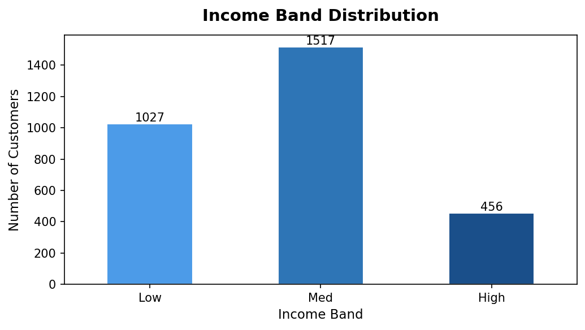
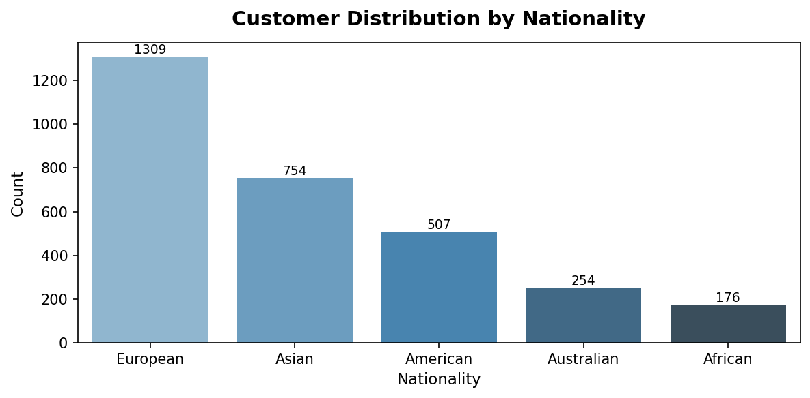
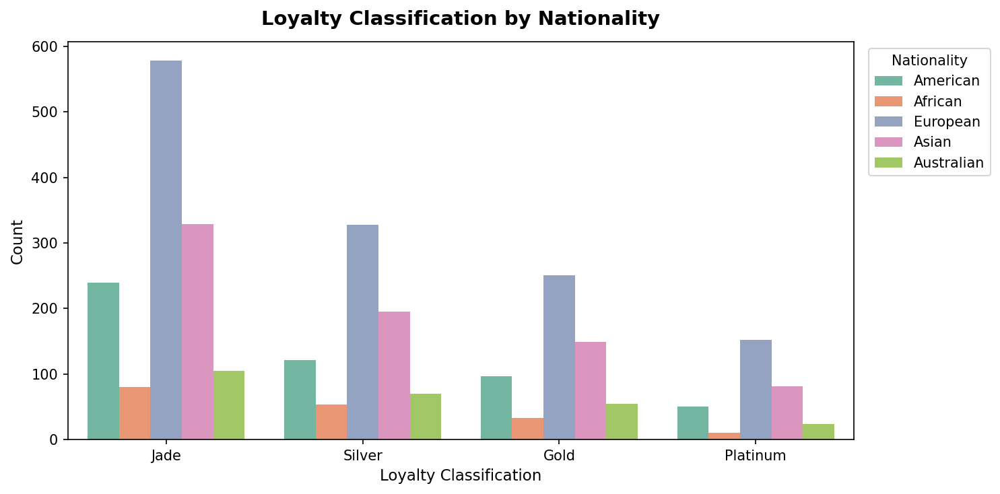
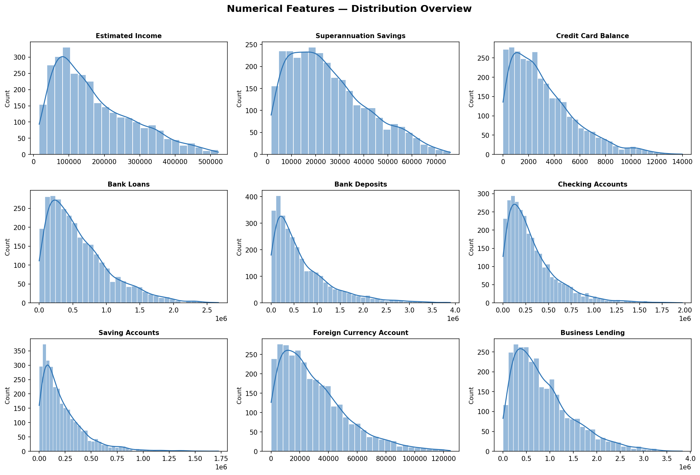
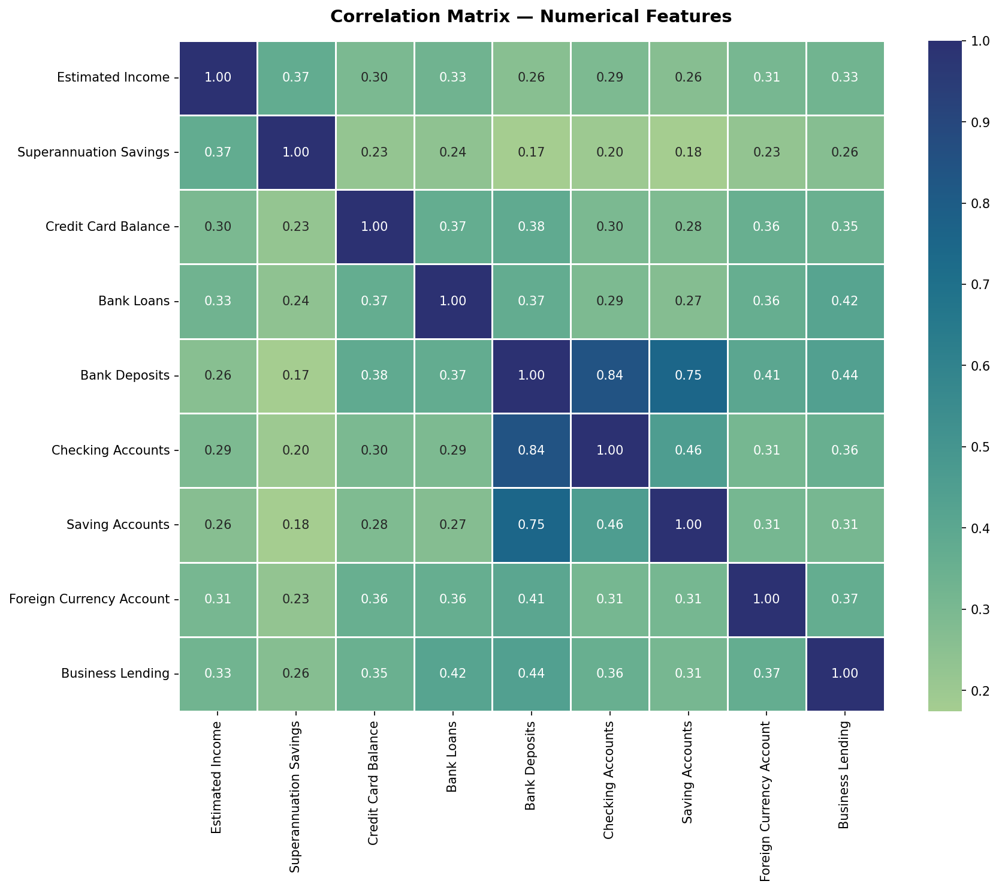

# 🏦 Banking Customer EDA: Risk Analytics

> Exploratory Data Analysis on a 3,000-row banking customer dataset using Python (Pandas, Seaborn, Matplotlib).

[](https://nbviewer.org/github/YowlaP/Banking-Customer-EDA-Exploratory-Data-Analysis/blob/main/notebooks/BankEDA.ipynb)
*(Click the badge above to view the fully rendered notebook with all interactive charts and outputs)*
---

## 📌 Problem Statement

Develop a basic understanding of **risk analytics in banking and financial services** and understand how data is used to **minimise the risk of losing money while lending to customers**.

---

## 📖 About the Dataset

The dataset contains detailed information about bank clients and their financial profiles. It is structured across **multiple interlinked tables** connected through primary and foreign keys:

| Table | Description |
|-------|-------------|
| **Banking Relationship** (`BRId`) | Type of banking relationship held by the client |
| **Client-Banking** | Core client table: demographics, financials, account balances |
| **Gender** (`GenderId`) | Client gender mapping |
| **Investment Advisor** (`IAId`) | Assigned investment advisor per client |
| **Period** | Time-related information (join date, tenure) |

**3,000 rows: 25 columns: No missing values.**

---

## 📁 Repository Structure

```
banking-eda/
│
├── data/
│   └── Banking.csv                        # Dataset (3,000 rows)
│
├── notebooks/
│   └── BankEDA_V1.ipynb                   # Main analysis notebook
│
├── visuals/
│   ├── income_band.png
│   ├── univariate_nationality.png
│   ├── bivariate_loyalty_nationality.png
│   ├── numerical_histograms.png
│   └── correlation_heatmap.png
│
├── requirements.txt
└── README.md
```

---

## 📊 Dataset Description

| Column | Type | Description |
|--------|------|-------------|
| `Client ID` | object | Unique customer identifier |
| `Age` | int | Customer age (17–85) |
| `Nationality` | object | European / Asian / American / Australian / African |
| `Occupation` | object | 195 unique job categories |
| `Fee Structure` | object | High / Mid / Low |
| `Loyalty Classification` | object | Jade / Silver / Gold / Platinum |
| `Estimated Income` | float | Annual estimated income in USD |
| `Superannuation Savings` | float | Retirement savings balance |
| `Amount of Credit Cards` | int | 1 to 3 cards |
| `Credit Card Balance` | float | Outstanding credit card balance |
| `Bank Loans` | float | Total bank loan balance |
| `Bank Deposits` | float | Total deposit balance |
| `Checking Accounts` | float | Checking account balance |
| `Saving Accounts` | float | Savings account balance |
| `Foreign Currency Account` | float | Foreign currency holdings |
| `Business Lending` | float | Business loan balance |
| `Properties Owned` | int | 0 to 3 properties |
| `Risk Weighting` | int | Internal risk score (1–5) |

---

## 🔍 Analysis Workflow

### 1. Data Loading & Overview
- Shape: `(3000, 25)` - no nulls detected
- Dtypes: 9 float64, 8 int64, 8 object
- Descriptive statistics via `df.describe()`

### 2. Feature Engineering
- `Income Band` created from `Estimated Income` using custom bins:
  - **Low** : < $100,000 → 1,027 customers (34%)
  - **Medium** : $100,000 – $300,000 → 1,517 customers (51%)
  - **High** : > $300,000 → 456 customers (15%)

### 3. Univariate Analysis
- Distribution of all categorical variables (count plots)
- Distribution of all numerical variables (histograms + KDE)

### 4. Bivariate Analysis
- All categorical variables broken down by `Nationality`

### 5. Correlation Analysis
- Pearson correlation matrix heatmap across all 9 numerical features

---

## 📈 Visuals

### Income Band Distribution
> The majority of customers fall in the **Medium income band** ($100k–$300k), with only 15% classified as High income: relevant context for assessing default risk across income segments.



---

### Univariate Analysis — Nationality
> **Europeans** represent the largest segment (44%), followed by Asians (25%) and Americans (17%). Understanding the nationality breakdown helps contextualise risk exposure across different regulatory and economic environments.



---

### Bivariate Analysis — Loyalty Classification × Nationality
> The Jade loyalty tier dominates across all nationalities, suggesting that high loyalty is a cross-segment characteristic rather than nationality-specific: a positive signal for overall portfolio stability.



---

### Numerical Features — Distribution Overview
> All financial balance columns show strong **right-skewed distributions**, indicating a concentration of customers with moderate balances and a long tail of high-value clients: a pattern typical of retail banking portfolios.



---

### Correlation Matrix
> The heatmap reveals the strongest financial relationships across the 9 numerical features, with key implications for credit risk assessment.



---

## 💡 Key Insights

1. **Bank Deposits is highly correlated with Checking, Saving, and Foreign Currency accounts** : customers with high deposit balances tend to hold substantial funds across all account types, pointing to a wealth concentration effect. These clients represent lower lending risk.

2. **Income distribution is dominated by the Medium band (51%)** : over half the customer base earns between $100k and $300k. This segment requires careful risk calibration as they are neither clearly low-risk nor high-risk borrowers.

3. **Risk Weighting is skewed toward low risk** : 70%+ of customers sit at Risk Weighting 1 or 2, but the tail (levels 4–5) represents ~160 high-risk profiles that warrant dedicated monitoring to minimise potential losses.

4. **Credit Card Balance shows weak correlation with Income** : credit usage appears driven more by spending behavior than earning capacity, reinforcing the need for behavioral data in credit risk models rather than income alone.

5. **Loyalty tier Jade dominates (44%)** : combined with the prevalence of the High fee structure (49%), this suggests a customer base that is both loyal and financially engaged, reducing the probability of sudden default or churn.

---

## 🛠️ Tech Stack

| Tool | Usage |
|------|-------|
| Python 3.10+ | Core language |
| Pandas | Data manipulation & feature engineering |
| Matplotlib | Base plotting |
| Seaborn | Statistical visualizations |
| NumPy | Numerical operations |
| Jupyter Notebook | Interactive analysis (Google Colab) |

---

## ▶️ How to Run

```bash
# 1. Clone the repository
git clone https://github.com/YOUR_USERNAME/banking-eda.git
cd banking-eda

# 2. Install dependencies
pip install -r requirements.txt

# 3. Launch the notebook
jupyter notebook notebooks/BankEDA_V1.ipynb
```

> Originally developed on **Google Colab**. To run locally, update the data path from `/content/Banking.csv` to `data/Banking.csv`.

---

## 📦 requirements.txt

```
pandas>=1.5.0
matplotlib>=3.5.0
seaborn>=0.12.0
numpy>=1.23.0
jupyter>=1.0.0
```

---

## 🗺️ Possible Next Steps

- [ ] Customer segmentation using K-Means clustering
- [ ] Credit risk scoring model (binary classification)
- [ ] Interactive dashboard with Plotly / Dash
- [ ] Statistical significance testing between risk weighting groups
- [ ] Outlier detection on high-value financial accounts

---

## 👤 Author

**Nicolas SAIZE**  
- 💼 [LinkedIn](https://linkedin.com/in/nicolas-saize)  
- 📧 prosaize@gmail.com

---

*Dataset is synthetic and used for educational/portfolio purposes only.*
